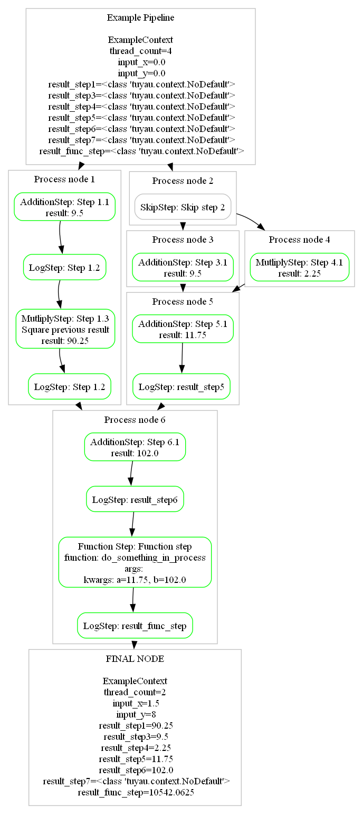

# Tuyau 🚀

A python library to make simple, parallelized pipelines using a graph structure! 

## Examples

### 1. Simply create your pipeline 🧑‍💻

The complete example code can be found [here](./examples/example.py) and the classes are [here](./examples/example_utils.py).

```python
pipeline = Pipeline(ExampleContext, "Example Pipeline")

context = ExampleContext(
    input_x=Var(1.5),
    input_y=Var(8),
)

node1 = PipeNode("Process node 1").add_steps(
    AddStep(
        x_field=context.input_x,
        y_field=context.input_y,
        res_field=context.result_step1,
        name="Step 1.1",
    ),
    LogStep(context.result_step1, name="Step 1.2"),
    MutliplyStep(
        x_field=context.result_step1,
        y_field=context.result_step1,
        res_field=context.result_step1,
        name="Step 1.3",
        comment="Square previous result",
    ),
    LogStep(context.result_step1, name="Step 1.2"),
)

node2 = PipeNode("Process node 2").add_steps(SkipStep("Skip step 2"))

node3 = PipeNode(name="Process node 3").add_steps(
    AddStep(
        x_field=context.input_x,
        y_field=context.input_y,
        res_field=context.result_step3,
        name="Step 3.1",
    )
)

node4 = PipeNode("Process node 4").add_steps(
    MutliplyStep(
        x_field=context.input_x,
        y_field=context.input_x,
        res_field=context.result_step4,
        name="Step 4.1",
    )
)
node5 = PipeNode("Process node ").add_steps(
    AddStep(
        x_field=context.result_step3,
        y_field=context.result_step4,
        res_field=context.result_step5,
        name="Step 5.1",
    )
)

node6 = PipeNode("Final process node").add_steps(
    MutliplyStep(
        x_field=context.result_step3,
        y_field=context.result_step5,
        res_field=context.result_step6,
        name="Step 6.1",
    ),
    LogStep(context.result_step6, name="Final logging!"),
)

(
    pipeline
    .add_children_to(pipeline.root_node, node1, node2)
    .add_children_to(node2, node3, node4)
    .add_parents_to(node5, node3, node4)
    .add_parents_to(node6, node5, node1)
    .connect_final_node()
)
```

### 2. Preview 🕵️

```python
directory = ...
graph = pipeline.graph(preview=True)
graph.render("example_preview", directory=directory, format="png")
```


### 3. Execute and check the result! 🎉🎉🎉

```python
pipeline.execute(context)
directory = ...
graph = pipeline.graph()
graph.render("example", directory=directory, format="png")
```


